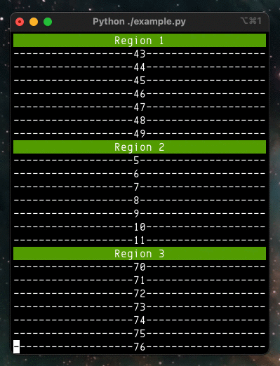

Terminal Window Scroll Region(s)
--------------------------------------------------------------------------------
This is a python 3.6+ class to present output on a terminal window in the form of one or more scroll regions using the ANSI escape control sequences supported by the terminal emulator. This means the scroll regions are very light weight (e.g. cannot be scrolled back to see history that has been scrolled off).

Each new instance will establish and print lines in a terminal scroll region whose position starts immediately after any previously instantiated scroll regions. That is, each region location is based on the number of rows in the region and how many regions have already been created.

In the case of multiple scroll regions, the number of regions is limited by the height of the terminal window (i.e. the window cannot be scrolled up and down to see scroll regions off-screen. As an example work around on macOS, <kbd>command</kbd>+<kbd>-</kbd> can be used to shrink the terminal window and fonts so more scroll regions will fit on-screen.

pdanford - January 2021



##### Title
Regions can either have a title or not. In the case of no title, regions have no separation. A title of " " can be used in this case to provide separation if desired.

##### Height
Default hight is 8 rows (including any title). This can be specified during region creation.

##### Width
Region width is technically all the way across the terminal window. But visually, it's whatever the title and lines added appear to be.

##### Scroll Delay
Note that by default there is a small delay after each line is added to allow some readability to regions being updated very quickly. This can be set to zero in the AddLine() call if undesirable. Conversely, don't set too large because it's blocking.

##### Regarding Terminal Window Size
If the terminal window height is not enough to display a complete scroll region for all scroll region instances, a highlighted "↓↓ more below ↓↓" message will appear at the last row of the terminal window which means more scroll region rows are hidden below.

Note that when terminal window height is increased, any more below state is updated during the next AddLine() call (since there is no terminal window size change callback).

### Use
```
from ScrollRegion import ScrollRegion

region = ScrollRegion("--- title ---")

for i in range(100):
    region.AddLine(i)
```

###### For the animated gif demo on this page, see [example](example.py).

### Requirements
- Python 3.6+ 
- Terminal with VT100 escape sequence compatibility (e.g. macOS terminal, iTerm2)

---
:scroll: [MIT License](README.license)

